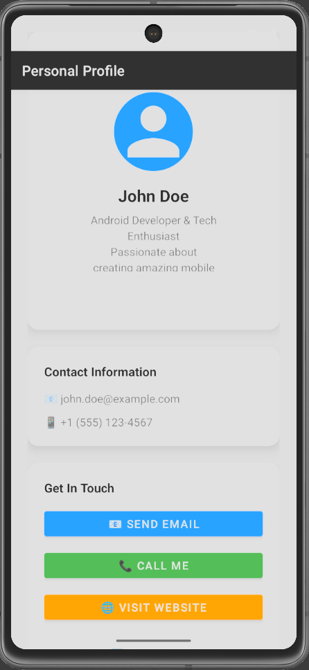
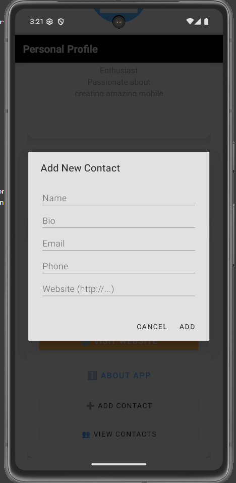
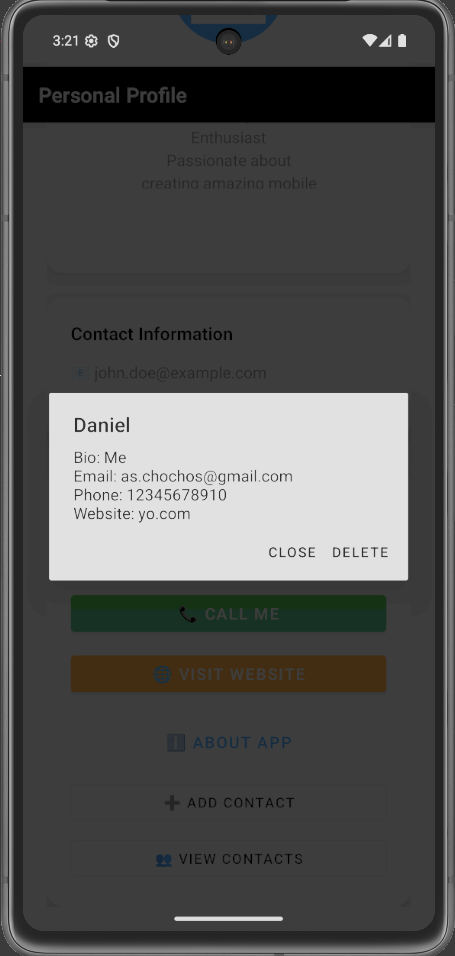

# Multi-User Contact App

A simple Android application for managing contacts without external databases—powered by SharedPreferences and JSON.
## 📸 App Preview

*Screenshots of the app in action:*

|                  Main Page                  |              Add Contact Dialog             |                View Contacts List               |
| :-----------------------------------------: | :-----------------------------------------: | :---------------------------------------------: |
|  |  |  |

---

## Features

### 1. Add New Contact

* **Fields:** Name, Bio, Email, Phone, Website
* **Dialog:** Tap **➕ Add Contact** to open a form dialog.
* **Validation:** Basic non-empty checks.

### 2. View Contacts List

* **List Dialog:** Tap **👥 View Contacts** to see all saved contacts.
* **Quick Delete:** Tap a contact’s name to view full details and delete if desired.

### 3. Persistent Storage

* **SharedPreferences + JSON:** No external database needed.
* **Automatic Sorting:** Newly added contacts appear at the end of the list.

### 4. Native Intents

* **Email:** Opens the default email client.
* **Phone:** Opens dialer with the contact’s number.
* **Web:** Opens browser to the contact’s website.

## Project Structure

```
Multi-User-Contact-App/
├── app/
│   ├── src/main/
│   │   ├── AndroidManifest.xml
│   │   ├── java/com/example/myapplication/
│   │   │   ├── data/Contact.kt
│   │   │   ├── data/ContactManager.kt
│   │   │   └── ui/MainActivity.kt
│   │   └── res/
│   │       ├── layout/activity_main.xml
│   │       └── layout/dialog_add_user.xml
│   └── build.gradle
├── build.gradle
└── settings.gradle
```

## Setup & Installation

1. **Clone the repo**

git clone [https://github.com/](https://github.com/)\<YOUR\_USERNAME>/Multi-User-Contact-App.git
cd Multi-User-Contact-App

2. **Open in Android Studio**
   - Select **Open an existing project** and navigate to the cloned directory.
3. **Build & Run**
   - Let Gradle sync, then click **Run**.

## Creating the GitHub Repository

If you haven’t already created the remote repo, you can use GitHub CLI:

# Authenticate once
gh auth login

# Create repo, push current code, set as origin
gh repo create Multi-User-Contact-App --public --source=. --remote=origin --push


Replace `<YOUR_USERNAME>` with your GitHub username when cloning.

## Dependencies

* AndroidX AppCompat
* Material Components
* ConstraintLayout
* RecyclerView
* Kotlin Standard Library


